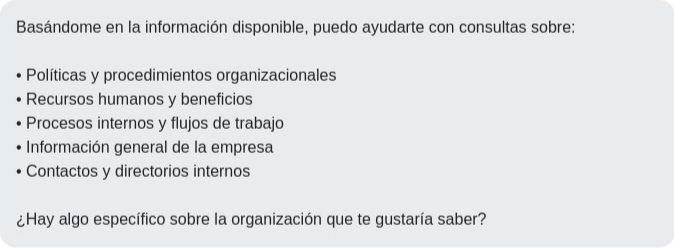

# Agente de IA Conversacional para la Transformación Organizacional



## 🚀 Visión General del Proyecto

Este proyecto tiene como objetivo principal el desarrollo e implementación de un **Agente de Inteligencia Artificial Conversacional** diseñado para optimizar los procesos de consulta y automatización dentro de una organización. La solución busca mejorar la eficiencia operativa, reducir los tiempos de respuesta y facilitar el acceso a la información interna, aprovechando tecnologías avanzadas de IA.

### **Autor:** Renzo Valencia Oyarce

## ✨ Características Principales

El Agente de IA Conversacional ofrece un conjunto robusto de funcionalidades para una interacción inteligente y eficiente:

-   **Chat Inteligente**: Procesamiento de lenguaje natural para entender y responder a las consultas de los usuarios de manera contextualizada.
-   **Clasificación de Consultas**: Utiliza modelos de Machine Learning para categorizar automáticamente las preguntas, dirigiéndolas a la información o módulo adecuado.
-   **Búsqueda Semántica**: Recuperación avanzada de información relevante de la base de conocimiento, basada en el significado y no solo en palabras clave.
-   **Base de Conocimiento Integrada**: Un sistema robusto para gestionar y acceder a documentos y datos organizacionales, garantizando respuestas precisas y actualizadas.
-   **Interfaz Web Intuitiva**: Una aplicación frontend moderna y responsiva que facilita la interacción del usuario con el agente.
-   **API RESTful Completa**: Un backend robusto desarrollado con FastAPI que expone todas las funcionalidades del agente a través de una API, permitiendo una fácil integración con otros sistemas.
-   **Modo Demo Integrado**: Funcionalidad que permite ejecutar el agente sin necesidad de una clave de API de OpenAI, utilizando respuestas simuladas para demostraciones y pruebas.

## 🏗️ Arquitectura del Sistema

El sistema sigue una arquitectura modular de **tres capas**, lo que garantiza escalabilidad, mantenibilidad y una clara separación de responsabilidades:

1.  **Capa de Interfaz de Usuario (Frontend)**:
    *   **Tecnologías**: HTML5, CSS3 (con Bootstrap para diseño responsivo), JavaScript.
    *   **Responsabilidad**: Proporcionar la interfaz de usuario para la interacción con el agente (chat, dashboard, configuración).

2.  **Capa de Lógica de Negocio (Backend)**:
    *   **Tecnologías**: Python 3.11, FastAPI (framework web asíncrono), Uvicorn (servidor ASGI).
    *   **Responsabilidad**: Orquestar las interacciones, procesar las solicitudes del frontend, coordinar con los servicios de IA y gestionar la API RESTful.

3.  **Capa de Servicios de IA y Datos**:
    *   **Tecnologías**: Python, SQLite, `sentence-transformers`, `scikit-learn`, OpenAI API.
    *   **Componentes**: Servicio GenAI (para interacción con LLMs), Servicio de Embeddings (para procesamiento de texto), Base de Conocimiento (SQLite para almacenamiento de datos y vectores), Clasificador de ML (para categorización de consultas), y Templates de Prompts (para guiar las respuestas del LLM).

## 🛠️ Tecnologías Utilizadas

-   **Backend**: Python 3.11, FastAPI, Uvicorn
-   **Frontend**: HTML5, CSS3 (Bootstrap 5), JavaScript
-   **Base de Datos**: SQLite
-   **IA/ML**: `sentence-transformers` (para embeddings), `scikit-learn` (para clasificación), OpenAI API (para generación de texto)
-   **Gestión de Entorno**: `python-dotenv`

## 🚀 Instalación y Ejecución

Para poner en marcha el Agente de IA Conversacional, sigue estos pasos:

### **1. Clonar el Repositorio (o descomprimir el archivo)**

Si has descargado el archivo `.zip` o `.tar.gz` del proyecto, descomprímelo en tu directorio de trabajo. Si es un repositorio Git, clónalo:

```bash
# Si es un archivo comprimido, descomprímelo primero
unzip agente_ia_demostracion_final_3.zip # o tar -xzf agente_ia_demostracion_final_3.tar.gz

# Navega al directorio del proyecto
cd agente_ia_tech
```

### **2. Configuración del Entorno Virtual**

Es altamente recomendable usar un entorno virtual para gestionar las dependencias del proyecto:

```bash
python3.11 -m venv venv
source venv/bin/activate  # En Windows: .\venv\Scripts\activate
```

### **3. Instalación de Dependencias**

Instala todas las librerías necesarias listadas en `requirements.txt`:

```bash
pip install -r requirements.txt
```

### **4. Configuración de Variables de Entorno**

Crea un archivo `.env` en la raíz del proyecto (`agente_ia_tech/`) con el siguiente contenido. Si no tienes una clave de OpenAI, el agente funcionará en modo demo con respuestas simuladas.

```dotenv
OPENAI_API_KEY=tu_clave_de_openai_aqui # O déjalo vacío para modo demo
MODEL_NAME=gpt-3.5-turbo
EMBEDDING_MODEL=all-MiniLM-L6-v2
DATABASE_PATH=./knowledge_base.db
HOST=0.0.0.0
PORT=8000
```

### **5. Ejecución del Servidor**

Inicia la aplicación FastAPI usando Uvicorn:

```bash
python -m uvicorn main:app --host 0.0.0.0 --port 8000
```

El servidor se iniciará en `http://0.0.0.0:8000`. Puedes acceder a la interfaz web desde tu navegador en `http://localhost:8000`.

## 📊 Beneficios Esperados (KPIs)

La implementación de este agente de IA conversacional se alinea con los siguientes beneficios y métricas clave:

-   **Mejora en Tiempos de Respuesta**: Reducción significativa del tiempo promedio para resolver consultas internas y externas.
-   **Reducción de Carga Operativa**: Disminución de la carga de trabajo en equipos de soporte y atención al cliente.
-   **Acceso Rápido a Conocimiento**: Facilita la consulta y recuperación de información organizacional de manera estructurada.
-   **Escalabilidad y Adaptabilidad**: Capacidad de crecer y adaptarse a nuevas funcionalidades y volúmenes de consultas.
-   **Optimización de Procesos**: Automatización de tareas repetitivas y mejora en la eficiencia de flujos de trabajo.

## 🤝 Contribución

Las contribuciones a este proyecto son bienvenidas. Si deseas mejorar alguna funcionalidad, reportar un error o proponer nuevas características, no dudes en abrir un *issue* o enviar un *pull request*.

## 📄 Licencia

Este proyecto se distribuye bajo la licencia MIT. Consulta el archivo `LICENSE` para más detalles.

---

